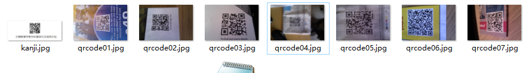

# super-qrcode-decoder

# 项目说明

工业级二维码解析/读取，高识别准确率，高速批量识别模糊二维码、证件二维码、文件二维码。

Industrial-grade qrcode parsing/reading, high recognition accuracy, high-speed batch recognition of fuzzy qrcode, ID photo qrcode, document photo qrcode

# 解决痛点(Solve pain points)

普通的二维码识别库，很难识别模糊、扭曲、部分缺失、尺寸很小的二维码，这个库是一个优秀的解决方案。

Ordinary QR code recognition library is difficult to recognize fuzzy, distorted, partially missing, and small QR codes. This library is an excellent solution.

# 应用场景(Application scenario)

各类证件照片、文件扫描件、生活照片上的二维码

QR codes on various ID photos, scanned documents, and life photos

# 模糊二维码示例(Fuzzy QR code example)

# 服务价格(Price)

请加知识星球沟通，不满意可以3天内退款
Please scan qr code to dicuss with the marketing manager, if you are not satisfied, you can refund within 3 days

